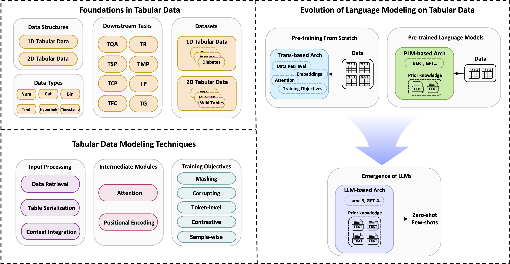

# Language Modeling on Tabular Data Survey
 
 

This is the repository of **Language Modeling on Tabular Data: A Survey of Foundations, Techniques and Evolution** , a comprehensive and systematic survey of the development of language modeling for tabular data. For details, please refer to our paper:

**Language Modeling on Tabular Data: A Survey of Foundations, Techniques and Evolution**  [[Paper](https://arxiv.org/pdf/2408.10548)]

*We will regularly update this repo with the latest resources. Please feel free to submit pull requests or contact us if you discover any relevant papers that are not yet included.*

## About This Survey
This paper providing a systematic review of the development of language modeling for tabular data, encompassing: 
* a categorization of different tabular data structures and data types;
* a review of key datasets used in model training and tasks used for evaluation;
* a summary of modeling techniques including widely-adopted data processing methods, popular architectures, and training objectives;
* the evolution from adapting traditional Pre-training/Pre-trained language models to the utilization of large language models;
* an identification of persistent challenges and potential future research directions in language modeling for tabular data analysis.

## Structure of Language Modeling on Tabular Data Survey

### LLM-based Methods
* TabLLM: Few-shot Classification of Tabular Data with Large Language Models. *AISTATS 2023* [[Paper](https://arxiv.org/pdf/2210.10723)]
* Language Models are Realistic Tabular Data Generators. *ICLR 2023* [[Paper](https://arxiv.org/pdf/2210.06280)]
* Generative Table Pre-training Empowers Models for Tabular Prediction. *EMNLP 2023* [[Paper](https://aclanthology.org/2023.emnlp-main.917.pdf)]
* Semi-supervised Tabular Classification via In-context Learning of Large Language Models. *ICML 2023 ES-FoMo Workshop* [[Paper](https://openreview.net/pdf?id=r77CeOBO0L)]
* Large Language Models are Versatile Decomposers: Decompose Evidence and Questions for Table-based Reasoning. *SIGIR 2023* [[Paper](https://arxiv.org/pdf/2301.13808)]
* TABLET: Learning From Instructions For Tabular Data. *Preprint 2023* [[Paper](https://arxiv.org/pdf/2304.13188)]
* TabuLa: Harnessing Language Models for Tabular Data Synthesis. *Preprint 2023* [[Paper](https://arxiv.org/pdf/2310.12746)]
* Multimodal LLMs for Health Grounded in Individual-specific Data. *Preprint 2023* [[Paper](https://arxiv.org/pdf/2307.09018)]
* UniPredict: Large Language Models are Universal Tabular Classifiers. *Preprint 2023* [[Paper](https://arxiv.org/pdf/2310.03266)]
* TabText: A Flexible and Contextual Approach to Tabular Data Representation. *Preprint 2023* [[Paper](https://arxiv.org/pdf/2206.10381)]
* REaLTabFormer: Generating Realistic Relational and Tabular Data using Transformers. *Preprint 2023* [[Paper](https://arxiv.org/pdf/2302.02041)]
* Table Meets LLM: Can Large Language Models Understand Structured Table Data? A Benchmark and Empirical Study. *WSDM 2024* [[Paper](https://arxiv.org/pdf/2305.13062v5)]
* MediTab: Scaling Medical Tabular Data Predictors via Data Consolidation, Enrichment, and Refinement. *IJCAI 2024* [[Paper](https://arxiv.org/pdf/2305.12081)]
* From Supervised to Generative: A Novel Paradigm for Tabular Deep Learning with Large Language Models. *KDD 2024* [[Paper](https://arxiv.org/pdf/2310.07338v4)]
* Confronting LLMs with Traditional ML: Rethinking the Fairness of Large Language Models in Tabular Classifications. *NAACL 2024* [[Paper](https://arxiv.org/pdf/2310.14607v2)]
* DTT: An Example-Driven Tabular Transformer for Joinability by Leveraging Large Language Models. *SIGMOD 2024* [[Paper](https://arxiv.org/pdf/2303.06748)]
* Chain-of-Table: Evolving Tables in the Reasoning Chain for Table Understanding. *ICLR 2024* [[Paper](https://arxiv.org/pdf/2401.04398)]

### PLM-based Methods

### Pre-training Methods
